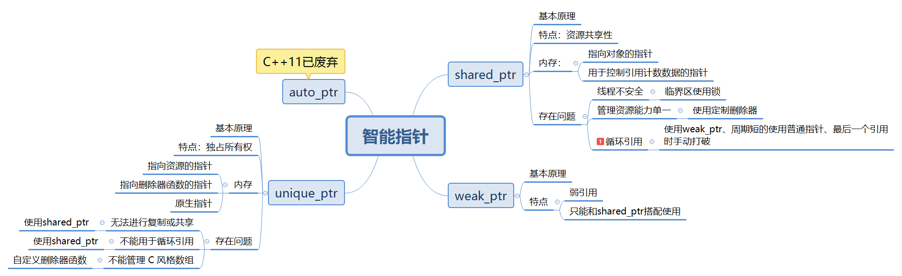

# 智能指针



C++11 新标准在废弃 auto_ptr 的同时，增添了 unique_ptr、shared_ptr 以及 weak_ptr 这 3 个智能指针来实现堆内存的自动回收。

C++ 智能指针底层是采用引用计数的方式实现的。智能指针在申请堆内存空间的同时，会为其配备一个整形值（初始值为 1），每当有新对象使用此堆内存时，该整形值 +1；反之，每当使用此堆内存的对象被释放时，该整形值减 1。当堆空间对应的整形值为 0 时，即表明不再有对象使用它，该堆空间就会被释放掉。

每种智能指针都是以类模板的方式实现的，shared_ptr 也不例外。`shared_ptr<T>`（其中 T 表示指针指向的具体数据类型）的定义位于`<memory>`头文件，并位于 std 命名空间中。

## shared_ptr

值得一提的是，和 unique_ptr、weak_ptr 不同之处在于，多个 shared_ptr 智能指针可以共同使用同一块堆内存。并且，由于该类型智能指针在实现上采用的是引用计数机制，即便有一个 shared_ptr 指针放弃了堆内存的“使用权”（引用计数减 1），也不会影响其他指向同一堆内存的 shared_ptr 指针（只有引用计数为 0 时，堆内存才会被自动释放）。

**基本原理：**就是记录对象被引用的次数，当引用次数为 0 的时候，也就是最后一个指向该对象的共享指针析构的时候，共享指针的析构函数就把指向的内存区域释放掉。

**特点:**它所指向的资源具有共享性，即多个shared_ptr可以指向同一份资源，并在内部使用引用计数机制来实现这一点。

### 存在问题及解决办法

[参考博客](https://blog.csdn.net/qq_42719751/article/details/102490671#test1)

shared_ptr智能指针有三个缺陷：

- 线程不安全;
- 管理资源能力单一：不能管理malloc出来的资源，不能管理文件指针；
- 可能会产生循环引用的问题；

#### 线程不安全

shared_ptr的线程安全分为两个方面：

1. shared_ptr智能指针对象中的引用计数是多个智能指针对象共享的，两个线程中智能指针的引用计数同时进行++或者 - -操作，在为加锁的情况下，会导致计数混乱，这样有可能造成资源泄漏或者程序奔溃的问题，而且++和- -操作本身也不是原子的。

2. 智能指针管理的对象保存在堆上，两个线程同时去访问，也会导致线程安全问题。

解决方法：所以为了保证线程安全，**需要在合适的地方加上锁在访问临界资源的地方（临界区）加上锁，访问完后解锁**。

#### 管理资源能力单一

shared_ptr只能处理用new申请出来的对象资源，那么当使用者用shared_ptr管理不是new申请出来的对象时，程序运行到释放资源的这一步就会出现错误。

解决方案：使用特殊删除器，这个特殊的删除器本质上就是仿函数,利用仿函数的特点来将shared_ptr智能指针管理资源能力单一的缺陷，即**将释放管理资源的任务交给定制出来的删除器来完成**。

#### 循环引用

[参考博客](https://blog.csdn.net/chenxijie1985/article/details/114837049)
两个对象相互使用shared_ptr成员变量指向对方造成循环引用，导致引用计数失效。即A内部有指向B，B内部有指向A，这样对于A，B必定是在A析构后B才析构，对于B，A必定是B析构后才析构A，这就是循环引用的问题，违反常规，导致内存泄露。

解决方法：

1. 当只剩下最后一个引用的时候需要手动打破循环引用释放对象。

2. 当A的生存期超过B的生存期的时候，B改为使用一个普通指针指向A。

3. 使用弱引用的智能指针打破这种循环引用。

#### 成员方法


## unique_ptr

它持有对对象的独有权，即**两个 unique_ptr 不能指向一个对象**，**不能进行复制操作只能进行移动操作**。unique_ptr 之所以叫这个名字，是因为它智能指向一个对象，即**当它指向其他对象时，之前所指向的对象会被摧毁**。其次，当 unique_ptr **超出作用域时，指向的对象也会被自动摧毁**，帮助程序猿实现了自动释放的功能。unique_ptr **也可能还未指向对象**，这时的状态被称为 empty。

**特点：**独占所有权。

### 存在问题及解决方法

#### 无法进行复制或共享

`unique_ptr` 具有独占所有权的特性，这意味着不能对其进行复制或共享，这可能限制了一些使用情况。

**解决办法**：如果需要共享资源，可以考虑使用 `shared_ptr`，它允许多个指针共享资源，并会在最后一个拥有者离开作用域时释放资源。

```cpp
#include <iostream>
#include <memory>

int main() {
    std::shared_ptr<int> sharedPtr = std::make_shared<int>(42);
    
    std::shared_ptr<int> anotherPtr = sharedPtr; // 多个 shared_ptr 共享资源
    return 0; // 资源在最后一个共享者离开作用域时释放
}
```

#### 不能管理 C 风格数组

`unique_ptr` 默认使用 `delete` 来释放资源，这意味着它不适用于管理 C 风格数组，需要使用 `delete[]`。

**解决办法**：可以自定义删除器函数来使用 `delete[]`，或者使用 `std::vector` 来管理动态数组。

```cpp
#include <iostream>
#include <memory>

int main() {
    std::unique_ptr<int[]> arrayPtr(new int[5]); // 使用 delete[] 释放资源
    return 0;
}
```

#### 不支持部分移动语义

`unique_ptr` 不支持部分移动语义，这意味着如果您想在拥有资源的同时保留一个空的 `unique_ptr`，有时会遇到困难。

**解决办法**：您可以将资源的所有权转移到一个临时 `unique_ptr`，然后将其释放，以保持原始 `unique_ptr` 为空。

```cpp
#include <iostream>
#include <memory>

int main() {
    std::unique_ptr<int> originalPtr = std::make_unique<int>(42);
    
    std::unique_ptr<int> tempPtr = std::move(originalPtr); // 转移资源所有权
    tempPtr.reset(); // 释放资源
    return 0; // originalPtr 现在为空
}
```

#### 不能用于循环引用

`unique_ptr` 不能用于处理循环引用，因为它的所有权模型不允许这种情况。

**解决办法**：如果需要处理循环引用，应该使用 `std::shared_ptr` 并慎重设计对象的生命周期。

### 其他注意事项

局部unique_ptr，可以作为返回值返回；

不能直接作为参数，需要以引用/const引用的方式作为参数。

### 成员方法

|API|作用|
|---|---|
|uptr.get()|获取原生指针（不能delete），所有权仍归uptr|
|uptr.release()|释放所有权、并返回原生指针（要负责delete）|
|uptr.reset()|uptr = nullptr等价，delete堆对象，同时置空指针|
|uptr.reset(p)|先delete uptr，再将所有权指向p指针|
|uptr.swap(uptr2)|交换两个智能指针|

## weak_ptr

`weak_ptr` 是 C++ 中的一个智能指针类型，用于协助管理动态分配的资源，通常与 `shared_ptr` 一起使用。`weak_ptr` 具有以下概念和特点：

**概念**：`weak_ptr` 用于解决 `shared_ptr` 可能导致的循环引用问题。循环引用是指多个 `shared_ptr` 彼此引用，形成一个环路，导致资源无法被正确释放。`weak_ptr` 允许您观察或访问由 `shared_ptr` 管理的资源，但不会增加资源的引用计数，因此不会影响资源的生命周期。

**特点**：

1. **弱引用**：`weak_ptr` 是一种弱引用，不会增加资源的引用计数。当所有 `shared_ptr` 指向资源都销毁后，资源将被释放，即使仍然存在 `weak_ptr`。

2. **无法直接访问资源**：`weak_ptr` 不能直接访问由 `shared_ptr` 管理的资源，因为它没有重载解引用操作符（`*` 和 `->`）。要访问资源，通常需要将 `weak_ptr` 转换为 `shared_ptr`。

3. **检查资源是否有效**：通过调用 `weak_ptr` 的 `expired()` 方法，可以检查与之关联的资源是否有效。如果资源有效，`expired()` 返回 `false`，否则返回 `true`。

4. **锁定资源**：通过调用 `weak_ptr` 的 `lock()` 方法，可以将其转换为与之关联的 `shared_ptr`。如果资源有效，`lock()` 返回一个有效的 `shared_ptr`，否则返回一个空的 `shared_ptr`。

下面是一个简单的示例，演示了 `weak_ptr` 的使用：

```cpp
#include <iostream>
#include <memory>

int main() {
    std::shared_ptr<int> sharedPtr = std::make_shared<int>(42);
    std::weak_ptr<int> weakPtr = sharedPtr;

    // 检查资源是否有效
    if (!weakPtr.expired()) {
        // 锁定资源，获取 shared_ptr
        std::shared_ptr<int> lockedPtr = weakPtr.lock();

        // 访问资源
        std::cout << "Value: " << *lockedPtr << std::endl;
    } else {
        std::cout << "Resource is expired." << std::endl;
    }

    // sharedPtr 离开作用域，资源仍然有效
    return 0;
}
```

在上面的示例中，`weak_ptr` 被用来观察与之关联的 `shared_ptr` 管理的资源，通过 `lock()` 方法可以获取有效的 `shared_ptr` 并访问资源。当 `sharedPtr` 离开作用域后，资源仍然有效，因为还有一个 `weak_ptr` 引用它。

### 成员方法

| 方法/操作               | 说明                                     |
| ----------------------- | ---------------------------------------- |
| `std::weak_ptr<T> wp`    | 创建一个`weak_ptr`，指向类型`T`的对象。          |
| `wp.use_count()`        | 返回与`wp`共享对象的`shared_ptr`的数量。          |
| `wp.expired()`          | 检查与`wp`关联的`shared_ptr`是否已经过期（即没有`shared_ptr`指向对象）。 |
| `wp.lock()`             | 尝试将`wp`转换为有效的`shared_ptr`，如果对象有效则返回有效的`shared_ptr`，否则返回空的`shared_ptr`。 |
| `wp.reset()`            | 释放`wp`，使其不再关联任何对象。                |
| `wp.swap(wp2)`          | 交换两个`weak_ptr`的内容。                   |
| `wp = sp`               | 将`shared_ptr`赋值给`weak_ptr`。             |
| `wp == wp2`            | 比较两个`weak_ptr`是否相等。                |
| `wp != wp2`            | 比较两个`weak_ptr`是否不相等。              |


